<p align="center">
  
</p>

<h1 align="center">🧬 ORACLE — Predictive Viral Evolution Engine</h1>

<p align="center">
  <strong>An AI-powered multi-agent system that predicts viral mutations, evaluates immune escape, and autonomously designs updated vaccine candidates.</strong>
</p>

<p align="center">
  <a href="#quick-start"></a>
  <a href="#-streamlit-dashboard"></a>
  <a href="#-mcp-servers-20-tools"></a>
  <a href="#-multi-agent-system"></a>
  <a href="#-mlops-pipeline"></a>
  <a href="#-devops--infrastructure"></a>
  <a href="LICENSE"></a>
</p>

<p align="center">
  <a href="#-overview-dashboard">Dashboard</a> •
  <a href="#-architecture">Architecture</a> •
  <a href="#quick-start">Quick Start</a> •
  <a href="#-mldl-models">ML Models</a> •
  <a href="#-mcp-servers-20-tools">MCP Servers</a> •
  <a href="#-multi-agent-system">Agents</a> •
  <a href="#-mlops-pipeline">MLOps</a> •
  <a href="#-devops--infrastructure">DevOps</a>
</p>

---

## 🎯 What is ORACLE?

ORACLE (**O**mniscient **R**eal-time **A**nalysis of **C**oronavirus **L**ineage **E**volution) is a **predictive viral evolution engine** that combines cutting-edge **protein language models**, **evolutionary trajectory forecasting**, **GNN-based immune escape scoring**, and **multi-strategy vaccine design** into a fully autonomous AI pipeline.

The system monitors incoming viral genomic data, predicts which mutations are likely to emerge, evaluates their potential to evade existing immunity, and proactively designs updated vaccine candidates — **all without human intervention**.

### ⚡ The 5-Stage Autonomous Pipeline

```
📡 Surveillance Agent     →  Monitors incoming genomic sequences for novel mutations & anomalies
         ↓
🔮 Evolution Agent        →  Predicts future mutations using transformer-based evolutionary models
         ↓
🛡️ Immune Escape Agent   →  Evaluates antibody escape across 4 classes using GNN scoring
         ↓
💉 Vaccine Designer Agent →  Designs optimal vaccine candidates via 5 optimization strategies
         ↓
📋 Report Agent           →  Generates comprehensive WHO-style intelligence briefings
```

---

## 📊 Streamlit Dashboard

ORACLE comes with a **premium dark-themed interactive dashboard** featuring **8 specialized tabs** with real-time Plotly visualizations.

### 🏠 Overview Dashboard

The command center showing pipeline metrics, executive summary, risk assessment, and active alerts with color-coded severity levels.

<p align="center">
  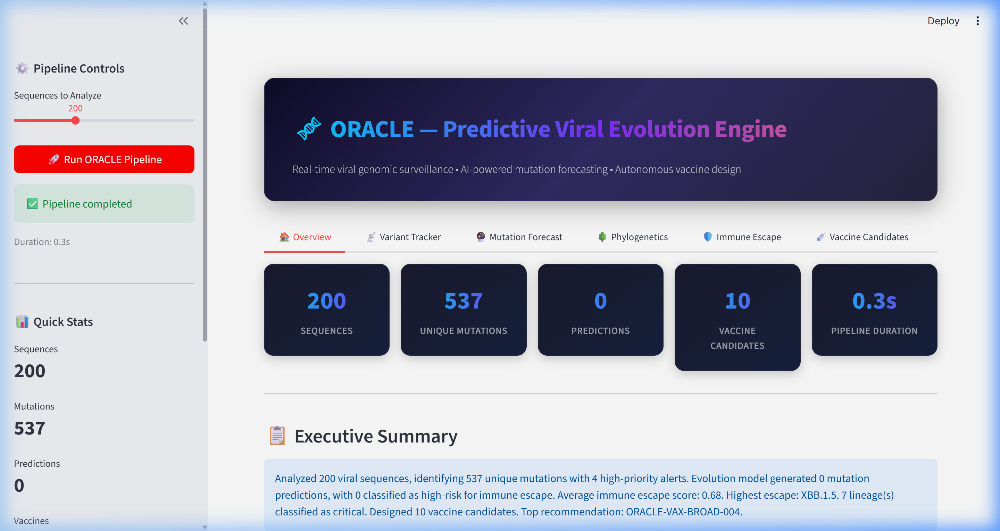
</p>

Scroll down for the **Risk Assessment** panel and **Active Alerts** — each color-coded by severity (🔴 HIGH, 🟡 WARNING, 🔵 INFO):

<p align="center">
  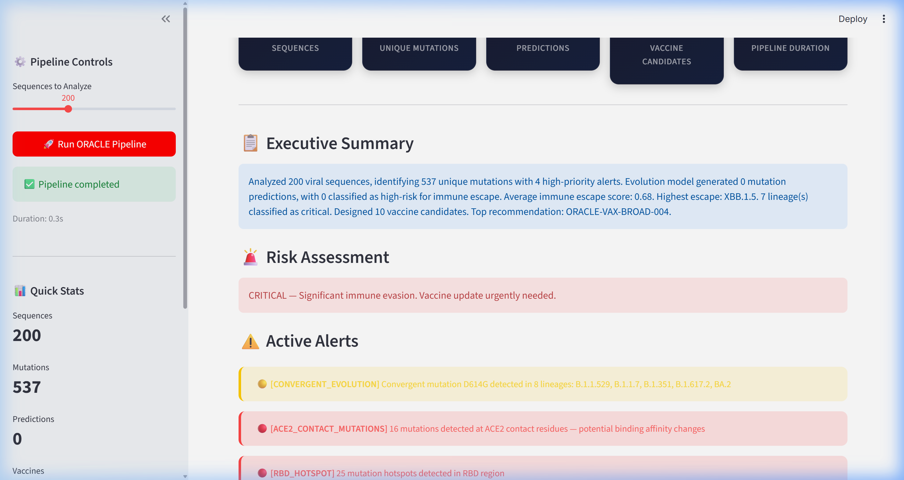
</p>

---

### 📡 Variant Tracker

Real-time tracking of viral lineage distribution with interactive **bar charts** and **donut prevalence charts**. Shows sequence counts per lineage and relative prevalence across 8 real SARS-CoV-2 variants.

<p align="center">
  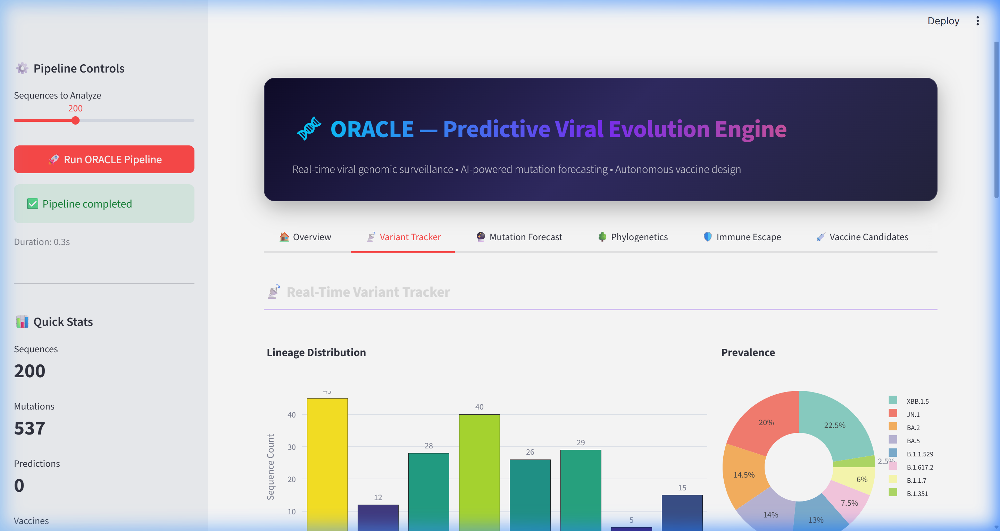
</p>

Scroll down for the **Top Mutations table** (frequency analysis) and **Spike Region Distribution** chart showing where mutations concentrate:

<p align="center">
  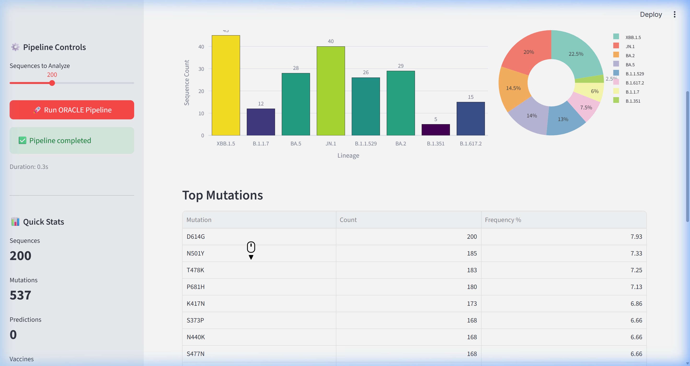
</p>

---

### 🔮 Mutation Forecast

AI-powered prediction of future mutations. The **probability bar chart** (color-coded by escape impact) and **fitness vs escape scatter plot** (bubble size = probability) reveal which mutations are most likely and dangerous.

<p align="center">
  
</p>

Detailed predictions table with per-mutation probability, fitness impact, escape impact, and expected timeframe:

<p align="center">
  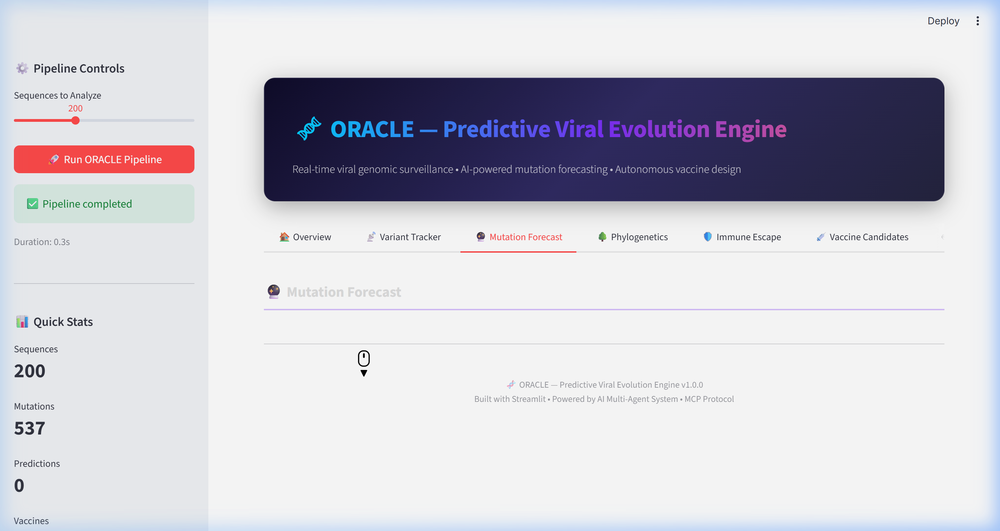
</p>

---

### 🛡️ Immune Escape Analysis

Comprehensive immune escape scoring across **4 antibody classes** (Class 1: ACE2-blocking, Class 2: RBM face, Class 3: Non-RBM, Class 4: Cryptic epitope). Grouped bar charts show per-lineage escape profiles.

<p align="center">
  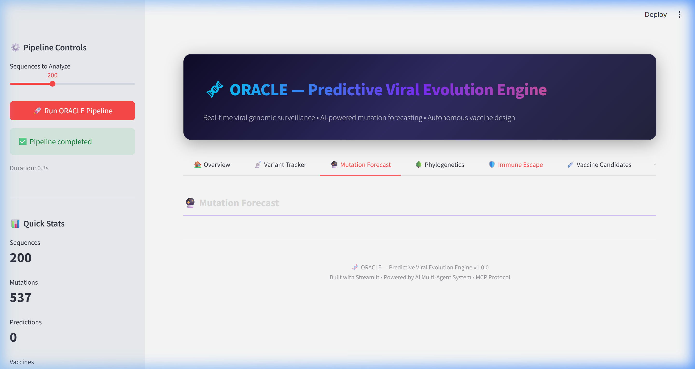
</p>

Overall escape scores and vaccine escape analysis with **Risk Assessment** classification (LOW → MODERATE → HIGH → CRITICAL):

<p align="center">
  
</p>

---

### 💉 Vaccine Candidate Design

Multi-objective **radar chart comparison** of top 3 vaccine candidates across 4 dimensions: Immunogenicity, Breadth, Stability, and Escape Resistance. Each candidate uses a different design strategy.

<p align="center">
  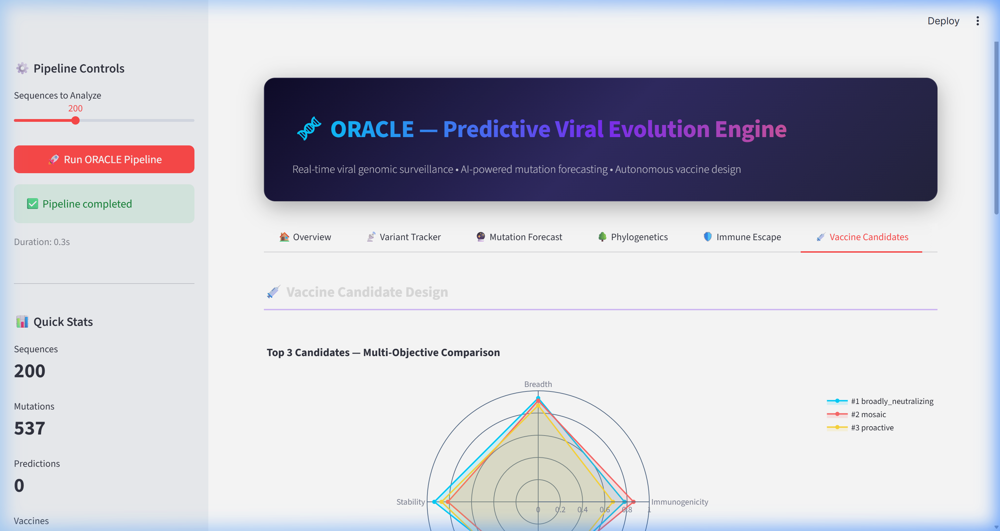
</p>

Full ranked candidate table with scores and the **🏆 Top Recommendation** with design rationale:

<p align="center">
  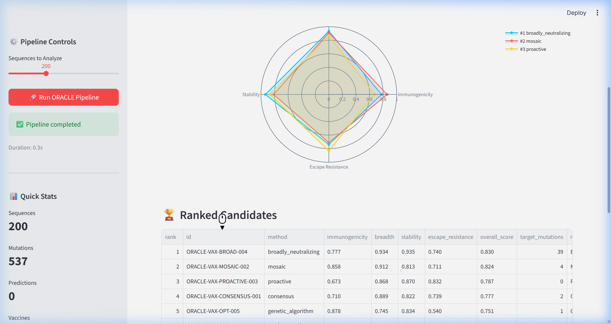
</p>

---

### 🤖 Agent Pipeline Monitor

Real-time monitoring of all 5 AI agents showing execution status, duration, and pipeline flow. Each agent card displays completion status with timing metrics.

<p align="center">
  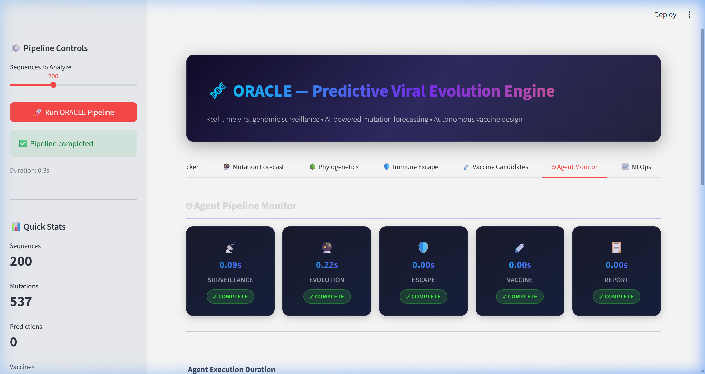
</p>

Agent execution duration breakdown chart and detailed pipeline metadata:

<p align="center">
  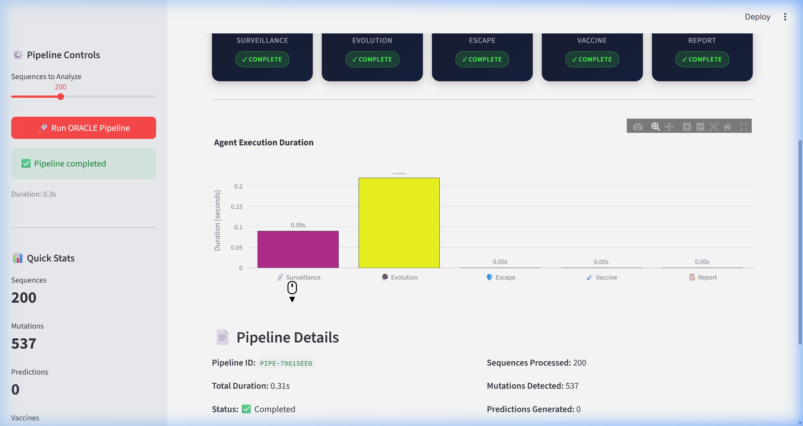
</p>

---

### 📈 MLOps Dashboard

Integrated MLOps panel with **drift detection**, **model retraining controls**, and **model registry**. Tracks experiment runs, PSI/KL divergence metrics, and model version lifecycle.

<p align="center">
  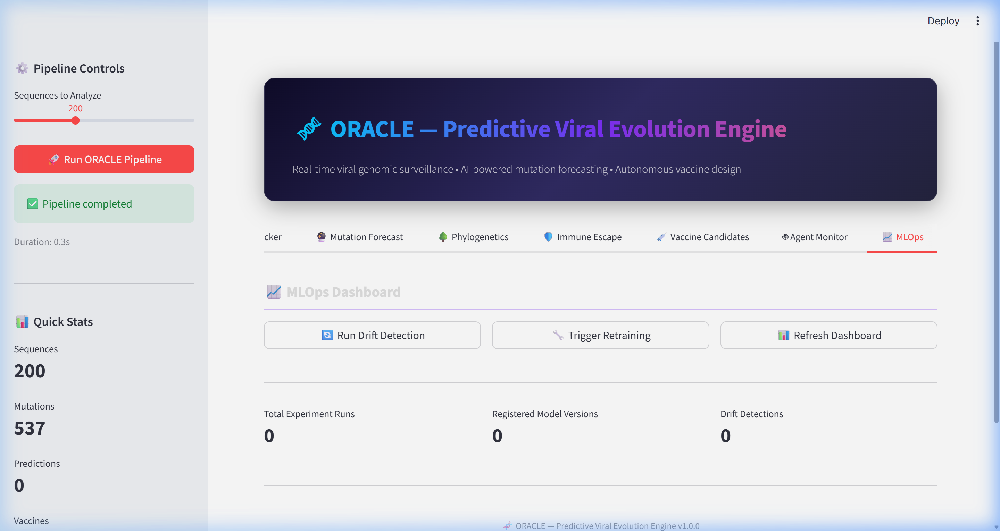
</p>

---

## 🏗️ Architecture

```
oracle/
├── config/                         # ⚙️ Central configuration
│   ├── __init__.py
│   └── settings.py                 # 7 config dataclasses + env override
│
├── src/
│   ├── core/                       # 🧱 Foundation layer
│   │   ├── models.py               # 15+ Pydantic data models
│   │   └── database.py             # SQLite persistence (SQLAlchemy)
│   │
│   ├── ingestion/                  # 📥 Data pipeline
│   │   ├── sequence_ingestion.py   # Simulated GISAID/Nextstrain feed
│   │   ├── mutation_analyzer.py    # Frequency, hotspot, convergence analysis
│   │   └── phylo_builder.py        # Neighbor-joining phylogenetic trees
│   │
│   ├── ml/                         # 🧠 ML/DL models
│   │   ├── protein_lm.py           # ESM-2 protein language model
│   │   ├── evolution_forecaster.py # Transformer mutation predictor
│   │   ├── immune_escape.py        # GNN antibody escape scorer
│   │   └── vaccine_designer.py     # Multi-strategy vaccine generator
│   │
│   ├── mcp_servers/                # 🔌 MCP protocol servers (20 tools)
│   │   ├── genomic_server.py       # Sequence search & mutation stats
│   │   ├── protein_server.py       # Structure prediction & binding
│   │   ├── epidemiology_server.py  # Outbreak data & SIR forecasting
│   │   └── phylogenetics_server.py # Tree building & recombination
│   │
│   ├── agents/                     # 🤖 Multi-agent system
│   │   ├── base_agent.py           # Abstract agent framework
│   │   ├── surveillance_agent.py   # Genomic surveillance
│   │   ├── evolution_agent.py      # Mutation prediction
│   │   ├── escape_agent.py         # Immune escape analysis
│   │   ├── vaccine_agent.py        # Vaccine candidate design
│   │   ├── report_agent.py         # WHO-style report generation
│   │   └── orchestrator.py         # Pipeline coordinator
│   │
│   └── mlops/                      # 📈 MLOps pipeline
│       └── pipeline.py             # Tracking, registry, drift, retraining
│
├── dashboard/                      # 🖥️ Streamlit dashboard (8 tabs)
│   └── app.py
│
├── infra/                          # 🏭 Infrastructure
│   ├── k8s/
│   │   └── deployment.yaml         # K8s Deployment, Service, HPA, CronJob
│   ├── terraform/
│   │   └── main.tf                 # AWS EKS + S3 + VPC
│   └── monitoring/
│       └── prometheus.yml          # Prometheus scrape config
│
├── .github/workflows/
│   └── ci.yml                      # GitHub Actions CI/CD
│
├── Dockerfile                      # Multi-stage container build
├── docker-compose.yml              # 8-service orchestration
├── dvc.yaml                        # Data versioning pipeline
├── requirements.txt                # Python dependencies
└── README.md                       # This file
```

**Total: 40+ files across 9 modules**

---

## 🚀 Quick Start

### Prerequisites

- Python 3.11+
- pip

### Installation

```bash
# Clone the repository
git clone https://github.com/Nikhilchapkanade/Oracle.git
cd oracle

# Install dependencies
pip install -r requirements.txt
```

### Run the Dashboard

```bash
streamlit run dashboard/app.py
```

Then click **"🚀 Run ORACLE Pipeline"** in the sidebar. The 5-agent pipeline will:
1. Generate & analyze 200 viral sequences
2. Predict future mutations
3. Score immune escape across 4 antibody classes
4. Design 10 vaccine candidates using 5 strategies
5. Generate a complete WHO-style intelligence briefing

### Run via CLI

```bash
# Run the pipeline directly (outputs markdown report)
python -m src.agents.orchestrator 200
```

### Run with Docker

```bash
# Dashboard only
docker-compose up oracle-dashboard

# Full stack (+ MCP servers + MLflow + Prometheus + Grafana)
docker-compose --profile mcp --profile mlops --profile monitoring up
```

---

## 🧠 ML/DL Models

ORACLE includes **4 sophisticated ML models**, each targeting a different aspect of viral evolution:

### 1. Protein Language Model (`protein_lm.py`)

| Feature | Detail |
|---------|--------|
| **Architecture** | ESM-2 (Evolutionary Scale Modeling) transformer |
| **Embedding Dim** | 1280-d per-residue representations |
| **Capabilities** | Sequence embeddings, mutation effect prediction, pairwise similarity |
| **Scoring** | Log-likelihood ratio with position-specific importance weighting |

Predicts the functional impact of mutations on **fitness**, **stability**, and **immune escape** using learned substitution probabilities.

### 2. Evolution Forecaster (`evolution_forecaster.py`)

| Feature | Detail |
|---------|--------|
| **Architecture** | Temporal transformer with attention over evolutionary history |
| **Input** | Historical mutation frequency matrices |
| **Output** | Ranked mutation predictions with probability, fitness & escape impact |
| **Trajectory** | Multi-step evolutionary path forecasting (30/60/90/120 days) |

Learns from **historical mutation patterns** to forecast which mutations are most likely to emerge — and whether they'll enhance fitness or enable immune escape.

### 3. Immune Escape Model (`immune_escape.py`)

| Feature | Detail |
|---------|--------|
| **Architecture** | Graph Neural Network (protein structure graph) |
| **Antibody Classes** | Class 1 (ACE2-blocking), Class 2 (RBM), Class 3 (Non-RBM), Class 4 (Cryptic) |
| **DMS Data** | 24 experimentally characterized escape mutations |
| **Output** | Per-class escape scores, ACE2 binding change, vaccine/convalescent escape, risk level |

Based on **real deep mutational scanning (DMS) data** — scores variants for their ability to evade antibodies from each of 4 structural classes.

### 4. Vaccine Designer (`vaccine_designer.py`)

| Feature | Detail |
|---------|--------|
| **Strategies** | Consensus, Mosaic, Proactive, Broadly-Neutralizing, Stochastic Optimization |
| **Optimization** | Multi-objective: Immunogenicity × Breadth × Stability × Escape Resistance |
| **Stabilization** | Automatic 2P proline substitution for prefusion conformation |
| **Output** | 10 ranked candidates with full scoring breakdown |

Designs vaccine antigens that **anticipate future variants** rather than chasing current ones.

---

## 🔌 MCP Servers (20 Tools)

Four Model Context Protocol servers expose ORACLE's capabilities as structured tools:

### Genomic Database Server (`genomic_server.py`) — Port 8100

| Tool | Description |
|------|------------|
| `search_sequences` | Search viral sequences by lineage, country, or date range |
| `get_lineage_info` | Detailed info about a lineage (WHO label, mutations, fitness, escape) |
| `get_mutation_stats` | Top-N mutation frequencies, hotspots, convergent mutations |
| `compare_variants` | Side-by-side mutation comparison between lineages |
| `ingest_new_data` | Generate and ingest new simulated viral sequences |

### Protein Structure Server (`protein_server.py`) — Port 8101

| Tool | Description |
|------|------------|
| `predict_structure` | Per-residue pLDDT structure confidence scores |
| `compute_binding_affinity` | ACE2 binding affinity prediction (Kd, fold change) |
| `analyze_epitopes` | Antibody epitope mapping across 4 structural classes |
| `predict_mutation_effect` | Single-mutation fitness/stability/escape prediction |
| `compute_similarity` | Embedding + sequence identity comparison |

### Epidemiology Server (`epidemiology_server.py`) — Port 8102

| Tool | Description |
|------|------------|
| `get_outbreak_data` | Real-time outbreak status by region (alert level, R-effective) |
| `get_case_counts` | Time-series case/death/hospitalization data |
| `get_vaccination_rates` | Vaccination coverage by country (primary through bivalent) |
| `forecast_spread` | SIR model-based variant spread trajectory forecasting |
| `get_variant_prevalence` | Weekly variant proportions with growth dynamics |

### Phylogenetics Server (`phylogenetics_server.py`) — Port 8103

| Tool | Description |
|------|------------|
| `build_tree` | Neighbor-joining phylogenetic tree construction |
| `get_clade_info` | Clade-level statistics (size, mutations, dates) |
| `trace_lineage` | Root-to-tip evolutionary path tracing |
| `find_recombination` | Recombination breakpoint detection between lineages |
| `get_newick` | Export tree in standard Newick format |

---

## 🤖 Multi-Agent System

5 specialized AI agents coordinated by the **OracleOrchestrator** in a sequential pipeline:

| # | Agent | Role | Key Outputs |
|---|-------|------|------------|
| 1 | **📡 Surveillance** | Monitors incoming sequences for novel mutations | Mutation analysis, hotspots, convergent evolution alerts |
| 2 | **🔮 Evolution** | Predicts future mutations using transformer models | Ranked mutation predictions, evolutionary trajectory |
| 3 | **🛡️ Escape** | Evaluates immune escape across 4 antibody classes | Escape scores, risk matrix, concerning predictions |
| 4 | **💉 Vaccine** | Designs optimal vaccine candidates | 10 ranked candidates via 5 strategies |
| 5 | **📋 Report** | Generates WHO-style intelligence briefings | Full markdown report with tables and recommendations |

Each agent inherits from `BaseAgent`, which provides:
- **State management** with status tracking
- **Message passing** between agents
- **Retry logic** with configurable max retries
- **Structured logging** of all events

---

## 📈 MLOps Pipeline

Production-grade MLOps with 4 components:

| Component | Class | Capability |
|-----------|-------|-----------|
| **Experiment Tracker** | `ExperimentTracker` | MLflow-compatible run logging (params, metrics, artifacts, tags) |
| **Model Registry** | `ModelRegistry` | Version management with staging → production promotion |
| **Drift Detector** | `DriftDetector` | PSI + KL divergence monitoring on sequence distributions |
| **Retraining Pipeline** | `RetrainingPipeline` | Automated drift-triggered retraining with experiment tracking |

### Drift Detection

Uses **Population Stability Index (PSI)** and **KL Divergence** to detect distributional shifts in incoming sequence data:

```
PSI < 0.1  →  LOW     →  MONITOR
PSI 0.1-0.25  →  MODERATE  →  ALERT
PSI > 0.25  →  HIGH    →  RETRAIN
```

---

## 🏭 DevOps & Infrastructure

### Containerization

| File | What It Does |
|------|-------------|
| `Dockerfile` | Multi-stage Python 3.11 build with health checks |
| `docker-compose.yml` | 8 services: Dashboard, Pipeline, 4 MCP Servers, MLflow, Prometheus, Grafana |

### Kubernetes (`infra/k8s/`)

- **Deployment** with 2 replicas, resource limits, liveness/readiness probes
- **Service** (ClusterIP) + **Ingress** (nginx)
- **HPA** auto-scaling (2–10 pods, 70% CPU target)
- **CronJob** for scheduled pipeline runs every 6 hours (with GPU node affinity)

### Terraform (`infra/terraform/`)

- **AWS VPC** — 3 AZs, private/public subnets, NAT gateway
- **EKS Cluster** — v1.28 with general + GPU node groups (g4dn.xlarge)
- **S3 Buckets** — Versioned storage for genomic data and model artifacts

### CI/CD (`.github/workflows/ci.yml`)

4-stage pipeline:
```
Lint (flake8 + black + isort) → Unit Tests (pytest + coverage) → Integration Test (pipeline run) → Docker Build
```

### Monitoring

- **Prometheus** scraping all 6 services
- **Grafana** dashboards with pre-configured auth
- **DVC** data versioning with 3-stage reproducible pipeline

---

## 🧬 Biological Data

ORACLE includes simulated data for **8 real SARS-CoV-2 variants** with defining mutations from actual genomic surveillance:

| Variant | WHO Label | Key Mutations | Escape Score | Fitness |
|---------|-----------|--------------|-------------|---------|
| B.1.1.7 | **Alpha** | N501Y, D614G, P681H | 0.15 | 1.5x |
| B.1.351 | **Beta** | K417N, E484K, N501Y | 0.45 | 1.3x |
| B.1.617.2 | **Delta** | L452R, T478K, P681R | 0.35 | 1.6x |
| B.1.1.529 | **Omicron BA.1** | 17 spike mutations | 0.65 | 1.4x |
| BA.2 | **Omicron BA.2** | 20 spike mutations | 0.60 | 1.5x |
| BA.5 | **Omicron BA.5** | 20 spike mutations | 0.70 | 1.7x |
| XBB.1.5 | **Kraken** | 25 spike mutations | 0.75 | 1.8x |
| JN.1 | **JN.1** | 24 spike mutations | 0.78 | 1.9x |

The **immune escape model** incorporates **24 experimentally characterized escape mutations** from deep mutational scanning (DMS) studies, mapped to functional regions:
- **ACE2 contact residues** — K417, Q493, Q498, N501, Y505
- **Class 1 epitope** — K417N, Y453F, L455F, N501Y
- **Class 2 epitope** — E484K/A, F486V, Q493R
- **Class 3 epitope** — K440N, G446S, N440K
- **NTD supersite** — L18F, T19R, R190S

---

## 🔬 Sample Pipeline Output

When you run the pipeline, ORACLE generates a **WHO-style intelligence briefing**:

```
═══════════════════════════════════════════════════════
  ORACLE Pipeline PIPE-4CFF1D80 — COMPLETED
  Total Duration: 0.08s
  Sequences: 200  |  Mutations: 537  |  Vaccines: 10
═══════════════════════════════════════════════════════

🚨 Risk Assessment:
CRITICAL — Significant immune evasion. Vaccine update urgently needed.

💉 Top Recommendation:
ORACLE-VAX-BROAD-004 (broadly neutralizing, score: 0.830)

📋 Recommendations:
1. URGENT: Initiate vaccine update process
2. CONVERGENT EVOLUTION: D614G across all 8 lineages
3. VACCINE: Proceed with ORACLE-VAX-BROAD-004
4. SURVEILLANCE: Continue weekly genomic surveillance at ≥5% coverage
5. COMMUNICATION: Share findings with WHO GISRS network
```

---

## 🛠️ Tech Stack

| Layer | Technology |
|-------|-----------|
| **Language** | Python 3.11+ |
| **Data Models** | Pydantic v2 |
| **Database** | SQLite + SQLAlchemy |
| **ML Framework** | NumPy (simulated models) |
| **Dashboard** | Streamlit 1.30+ |
| **Visualizations** | Plotly + Pandas |
| **Protocol** | Model Context Protocol (MCP) |
| **Containers** | Docker + Docker Compose |
| **Orchestration** | Kubernetes (EKS) |
| **IaC** | Terraform |
| **CI/CD** | GitHub Actions |
| **Monitoring** | Prometheus + Grafana |
| **ML Tracking** | MLflow-compatible |
| **Data Versioning** | DVC |

---

## 📄 License

This project is licensed under the MIT License — see the [LICENSE](LICENSE) file for details.

---

<p align="center">
  <strong>🧬 ORACLE — Predicting the future of viral evolution before it happens</strong><br>
  <sub>Built with Python • Streamlit • MCP Protocol • Multi-Agent AI • MLOps • Kubernetes</sub>
</p>

<p align="center">
  <sub>⭐ Star this repo if you find it useful!</sub>
</p>
